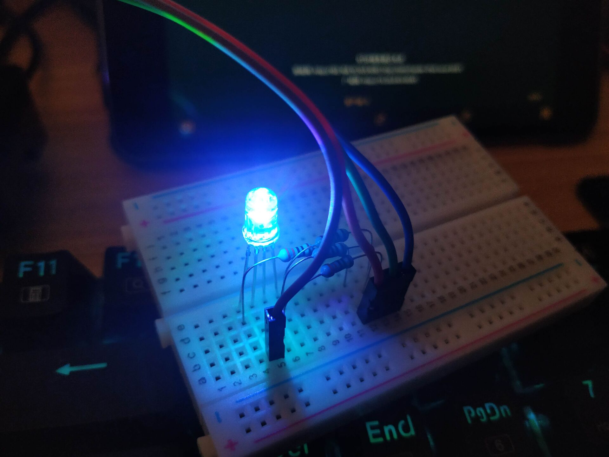

# Final Project: Controlling the LED by Gesture

## [Demo Vedio](GCL_demo.mp4)
 

## Description
Making different gestures in front of the camera to manipulate the RGB LEDs - e.g. adjusting brightness, changing color.

## Hardware Requirement
Raspberry Pi  
Camera  
Breadboard  
RGB LED  
Resistances  
Wires  

## Programming Language
Python

## Important Dependent Package
socket  
RPi.GPIO  
cv2  
paddlex  
imutils  
