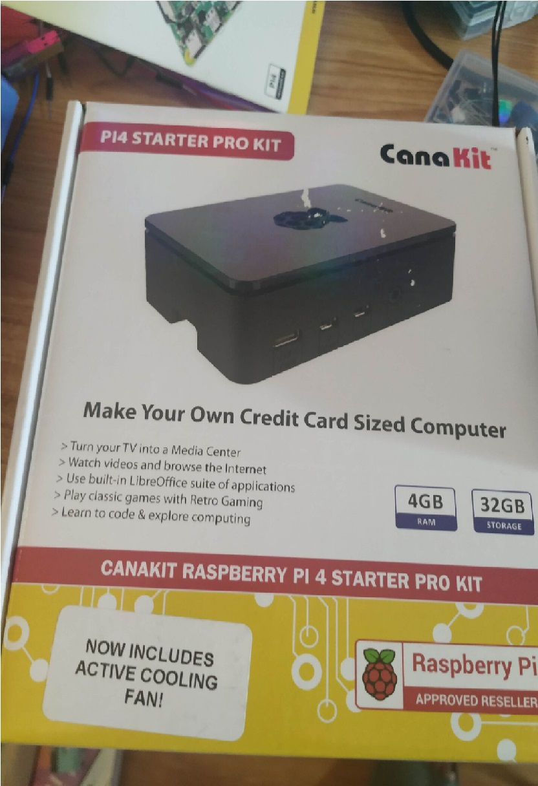
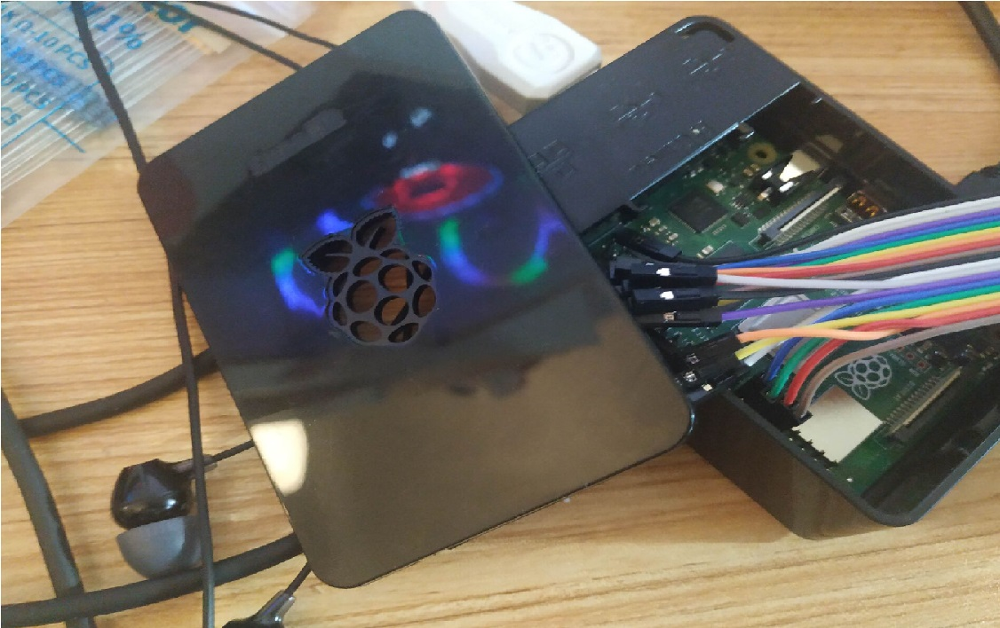
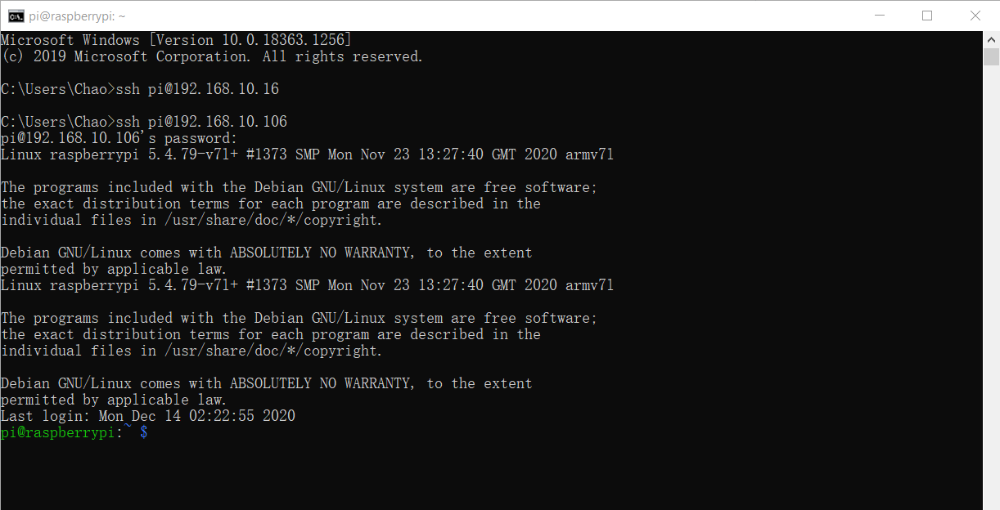

# Lab1
## Lab1A: Raspberry Pi and Wi-Fi
My Pi:  
  Raspberry Pi 4B  
  4GB RAM  
  32GB SD Card  
  with WIFI and Bluetooth  
  
  
Install operation system  
Set username and password  
Access to network via Wi-Fi  
Reboot  
## Lab1B: Configuration
 Enable SSH, VNC, remote RGIO etc.
## Lab 1C: Startup Mailer
Sign-in to Google  
Setup Mail  
Clone IoT repository  
Edit startup_mailer.py  
Run startup_mailer.py  
## Lab 1D: SSH and VNC
Connect to Pi via ssh  
Try some basical command  
Edit sshscript.sh  
Run servedo.net to connect to Pi  

